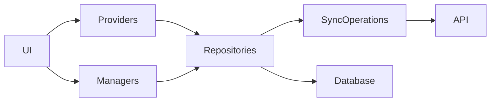

# Contributing to Kover

Thank you for your interest in contributing to Kover. This document outlines the guidelines for effective collaboration across the Kover codebase and aims to ensure a smooth, productive experience for all contributors.

---

## Table of Contents

<!--toc:start-->

- [Contributing to Kover](#contributing-to-kover)
  - [Table of Contents](#table-of-contents)
  - [AI Assistance Disclosure](#ai-assistance-disclosure)
    - [Examples](#examples)
  - [Reporting Issues](#reporting-issues)
  - [Requesting Features & Enhancements](#requesting-features-enhancements)
  - [Developing Kover](#developing-kover)
    - [Codebase Overview](#codebase-overview)
    - [Architecture](#architecture)
    - [Codestyle guidelines](#codestyle-guidelines)
    - [Setting Up Your Development Environment](#setting-up-your-development-environment)
    - [Making Changes](#making-changes)
  - [Pull Request Guidelines](#pull-request-guidelines)
  - [Release Process](#release-process)
  - [Getting Help and Community](#getting-help-and-community)
  <!--toc:end-->

---

## AI Assistance Disclosure

> [!IMPORTANT]  
> If any AI tool was used while contributing to Kover, it must be disclosed in the pull request.

Please state in your PR whether AI assistance was used and to what extent (for example, _docs only_ or _code generation_).  
If AI-generated text was used in PR discussions or responses, disclose that as well.  
Minor autocomplete or keyword suggestions do not require disclosure.

### Examples

> This PR was written primarily by Claude Code.  
> I used Cursor to explore parts of the codebase, but the implementation is fully manual.

AI-assisted contributions are welcome, but contributors remain fully responsible for the code they submit. An understanding
of the submitted code and readiness to apply changes is expected regardless of AI involvement.

Being this a hobby project and to avoid wasting anyone's time, in cases where AI-generated code is not up to standard,
maintainers may reserve the right to reject the contribution or request significant revisions.

Always disclose AI involvement to maintain transparency and respect for maintainers’ time.

## Reporting Issues

Kover uses GitHub issues to track bugs and improvements. Before opening a new issue:

- Search existing issues for duplicates.
- Provide clear, reproducible steps to demonstrate bugs.
- Include device info, OS version, Kover version, Kavita version, and any other relevant information.
- Apply the `bug` label to the issue for easier triage; no title prefix needed.

## Requesting Features & Enhancements

Please submit feature and enhancement requests as GitHub issues labeled `enhancement`.

When creating a new feature request:

- Check if the idea or similar request exists.
- Use reactions like 👍 to support existing requests.
- Clearly describe the use case and potential benefits.
- Include screenshots when relevant.

If an idea is not yet clearly defined, consider starting a discussion instead of an issue to gather community input.

---

## Developing Kover

### Codebase Overview

Kover is built with [Flutter](https://flutter.dev/) and uses [Riverpod](https://riverpod.dev/) and [Drift](https://drift.simonbinder.eu/) as the core dependencies to the offline-first architecture.
Futhermore, the repo makes heavy use of code generation:

- [Freezed](https://pub.dev/packages/freezed) for immutable UI data classes.
- [Riverpod](https://riverpod.dev) for state management and dependency injection.
- [Drift](https://drift.simonbinder.eu/) for database schema and queries.
- [Swagger Dart Generator](https://pub.dev/packages/swagger_dart_generator) and [Chopper](https://pub.dev/packages/chopper) for API client generation.

No generated code is committed to the repository, with the exception of database migrations.

Flutter (Dart) code lives under `lib` and is the main focus for code contributions. Platform specific code is avoided as
much as possible in order to maintain consistency and platform support. The same holds for platform specific dart code
e.g. through `Platform.isXY` checks.

### Architecture

The app is structured as follows:



- **UI**: Flutter widgets and screens that compose the user interface.
- **Providers**: thin Riverpod providers that manage state and expose data to the UI.
- **Managers**: classes managing more complex background operations, such as server synchronization or downloads.
- **Repositories**: classes responsible for data access, abstracting away the source (local database or remote API).
- **SyncOperations**: API wrappers handling HTTP requests and responses, including DTO mapping.
- **Database**: Drift database schema and queries.

### Codestyle guidelines

- Use [dot shorthands](https://dart.dev/language/dot-shorthands) whenever applicable.
- Prefer [switch expressions](https://dart.dev/language/branches#switch-expressions) over statements.
- Prefer constants over magic strings and number. If a constant is not defined yet, consider whether it should be added to the codebase.
  - For example for UI padding values, icon sizes, etc.
- Avoid stateful widgets as much as possible. When local state is necessary, use [hooks](https://pub.dev/packages/flutter_hooks).
- Use exclusively generated Riverpod providers.
- Use Riverpod providers for dependency injection and state management. Including for managers and repository instances.
- Always use generated API classes for API calls.
- Avoid manually modifying generated code.
- Avoid violating the architecture layer boundaries.
  - For example, UI code should not directly access the database or API, but rather go through providers and managers.

### Setting Up Your Development Environment

- Fork the Kover repository on GitHub.
- Clone your fork:

```

git clone git@github.com:yourusername/kover.git
# or
git clone https://github.com/yourusername/kover.git
cd kover

```

- Setup [fvm](https://fvm.app/) and run

```
fvm use
```

to ensure you have the correct Flutter version.
Optionally alias the flutter and dart commands to fvm:

```
alias flutter="fvm flutter"
alias dart="fvm dart"
```

This allows you to run flutter and dart commands without prefixing them with `fvm`.

- Install Flutter dependencies:

```
fvm flutter pub get
```

- Generate the necessary code:

```
fvm dart run build_runner build --delete-conflicting-outputs
# or
fvm dart run build_runner watch --delete-conflicting-outputs
```

### Making Changes

- Stay up to date by syncing with upstream:

```bash
# Add the upstream remote only once (skip if already added)
git remote add upstream https://github.com/rodonisi/kover.git
# Fetch latest changes from upstream
git fetch upstream
# Rebase your current branch onto the upstream default branch
git rebase upstream/main
```

- Create a descriptive feature or bugfix branch:

```

git checkout -b feat/feature-name
```

- Commit changes with clear, concise messages.
- Push changes to your fork:

```

git push --set-upstream origin feat/feature-name

```

---

## Pull Request Guidelines

Kover uses [Conventional Commits](https://www.conventionalcommits.org/) to generate version tags. PRs are
also merged exclusively through squash merges using the PR title as the commit message.
Furthermore, the PR titles are used to generate and organize release notes based on PR tags.
Adhering to branch naming conventions helps the PR being labeled automatically.

When submitting a pull request:

- Follow Kover's style for the PR title:
  - feat!: for breaking changes
  - feat: for new features
  - fix: for bug fixes
  - chore: for maintenance tasks
  - ci: for CI-related changes
  - **note:** since PRs are squashed, following the commit style within a branch is optional.
- The title should clearly summarize the change and state what the commit does when applied, in present tense.
  - Keep in mind that the PR title will also be the changelog entry for the merged commit, so it should be clear and informative on its own.
- Reference any related issue(s) using keywords like `closes #123`. If a change is not trivial, please open an issue
  first to gather feedback before implementing.
- Provide a detailed description in the PR body, explaining what, why, and any impacts.
- Include screenshots or recordings if UI changes are involved.
- Ensure CI checks are green and changes do not break support on any platform.
- Confirm that the branch is up to date with `main` before submission.
- Mention if AI-generated code or content was used (see [AI Assistance Disclosure](#ai-assistance-disclosure)).
- Keep PRs focused; avoid bundling unrelated changes together. If a PR includes multiple unrelated changes, a request
  for splitting will be made, or the PR will be rejected.
- If there are changes affecting the DB schema, a migration has to be included following the [Drift documentation](https://drift.simonbinder.eu/migrations/),
  including migration tests.
- Dependency management is responsibility of the maintainers. Please refrain from updating, adding or removing
  dependencies without prior discussion and approval.

PRs require review and approval by maintainers before merging.

---

## Release Process

- Kover follows semantic versioning (`MAJOR.MINOR.PATCH`).
- Releases are automated through GitHub Actions and triggered manually.
- There currently is no regular release schedule, but releases are rather triggered based on the accumulated features
  and fixes after internal testing.

---

## Getting Help and Community

- Use GitHub discussions or open issues to get assistance or report problems.

---

Thank you for contributing to make Kover better for everyone!
